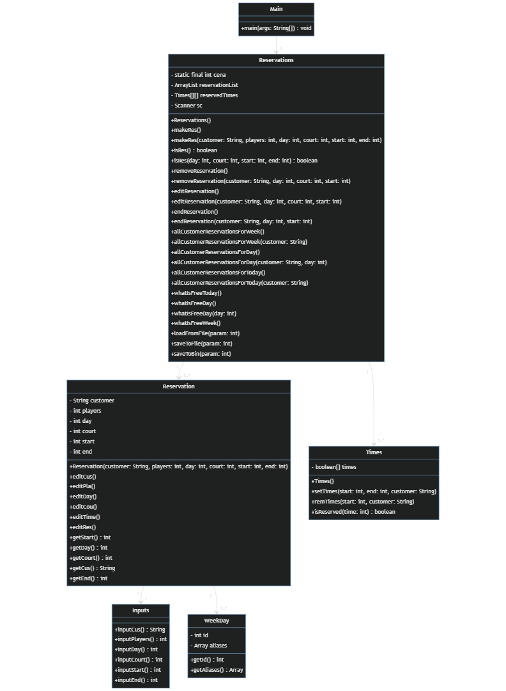

## **Zadání Semestrální práce**

### **Motivace**
Můj otec chtěl už dlouho implementovat rezervační systém pro Tenisový klub u nás ve městě, aby chod v tamní klubu šel hladce a bylo vše aspoň nějak evidováno. Tak mě napadlo, proč s tímto nezačít jako se semestrální prací.

### **Vytvoření rezervačního systému pro Tenisové kurty.**
Tato aplikace bude ovládána přes příkazy v příkazové řádce Javy. Program bude fungovat tak, že poté, co se zapne, tak bude čekat na příkazy od uživatele. Budou zde příkazy jako např. list(vypíše časy v daném dni, ke kterým jsou přiřazené rezervace + info k dané rezervaci, v případě že zde není žádný napsaný, vyhodí hlášku); res + vstupní prvky (zarezervuje v zadaném čase zadaný kurt pro zadaný počet lidí); rem(odstranění rezervace); edit(úprava rezervace); atd. . Nadále ve výpisech bude automaticky spočítaná cena za rezervaci i za odehrané hodiny na kurtě.

Veškeré příkazy budou u finální verze programy napsány v commandu help, či zde v readme.

### **Rozvržení na body.**
-rozdělení podle času (časové úseky po 1 hodině) <br />
-možnost rezervování daného kurtu na přesný čas <br />
-možnost zadat kolik hráčů bude hrát na daném kurtu pro rozpočítání ceny <br />
-rezervace budou uloženy do dynamického pole, pro lepší práci s daty<br />
-program bude ukládat rezervace do souboru po týdnu(bude možnost zapisovat na aktuální týden a následující)<br />
-bude zde command "newWeek" který vezme soubor s aktuálním týdnem a jeho obsah připíše na konec souboru s historií rezervací, soubor s následujícím týdnem se přepíše do souboru s aktuálním týdnem a soubor s následujícím týdnem bude volný pro nová data<br />

### **Popis Struktury vstupních a výstupních souborů**
-Je zde možnost ukládání a čtení dat z binárních souborů, či do datového typu .json<br />
-data jsou pojmenovány: "save_(číslo týdne v roce).dat/json" a jsou rozděleny do složek podle datového typu souboru<br />
-Data jsou při ukončení programu zapsány do datové struktury **.json** s pomocí externí knihovny **GSON** pro Java Maven - toto bude primární datový výstup<br />

### **Class Diagram**


### **Testování**
| **#** |                   **test**                   |               **vstup**           |                   **výsledek**                      |
|-------|----------------------------------------------|-----------------------------------|-----------------------------------------------------|
|   1   | Tvorba rezervace                             | 1/res + parametry pro vytvoření   | Vytvoření rezervace a přidání do seznamu            |
|   2   | Editace rezervace                            | 2/edit + parametry pro editaci    | Zeditovaná rezervace a přidání do seznamu           |
|   3   | Odstranění rezervace                         | 3/rem + parametry pro odstranění  | Odstranění rezervace ze seznamu a uvolnění časů     |
|   4   | Výpis rezervací daného uživatele             | 4/list + parametry pro výpis      | Vypsání rezervací daného uživatele                  |
|   5   | Zjištění zda časový úsek je volné            | 5/isres + parametry pro zjištění  | Výpis zda je časový úsek volný                      |
|   6   | Vypsání ceny za rezervaci                    | 6/endres + parametry pro výpis    | Vypsání ceny pro jednoho hráče + za celý kurt       |
|   7   | Výpis volných míst v daný den/v týdnu        | 7/isfree + parametry              | Vypsání všech volných míst v daný den/v celém týdnu |
|   8   | Přehození mezi aktuálním/následujícím týdnem | 8/switch                          | true                                                |
|   9   | Uložení dat do souborů                       | 9/save + parametry                | Uložení dat do souborů podle výběru uživatele       |
|   10  | Výpis pomocného commandu                     | help                              | true                                                |
|   11  | Výpis printstacktrace, při chybě programu    | debug                             | true                                                |


### **Použití externích knihoven**
Externí knihovna pro ukládání dat do .json přes knihovnu GSON.

### **Čtení a načítání JSON souborů**
**Data v objektu třídy Reservation v projektu:**<br />
customer=kokos.padavy<br />
players=69<br />
day=2<br />
court=5<br />
startHour=14<br />
endHour=15<br />

**Data z objektu převedená do JSONu:**<br />
[{"customer":"kokos.padavy","players":69,"day":2,"court":5,"startHour":14,"endHour":15}]<br />

**Následné parsování:**
```java
//pro ukládání do souboru
String serialized = gson.toJson(reservationList);
//pro čtení ze souboru
this.reservationList = gson.fromJson(new FileReader("./cesta/k/souboru.json"),  new TypeToken<ArrayList<Reservation>>(){}.getType());
```
