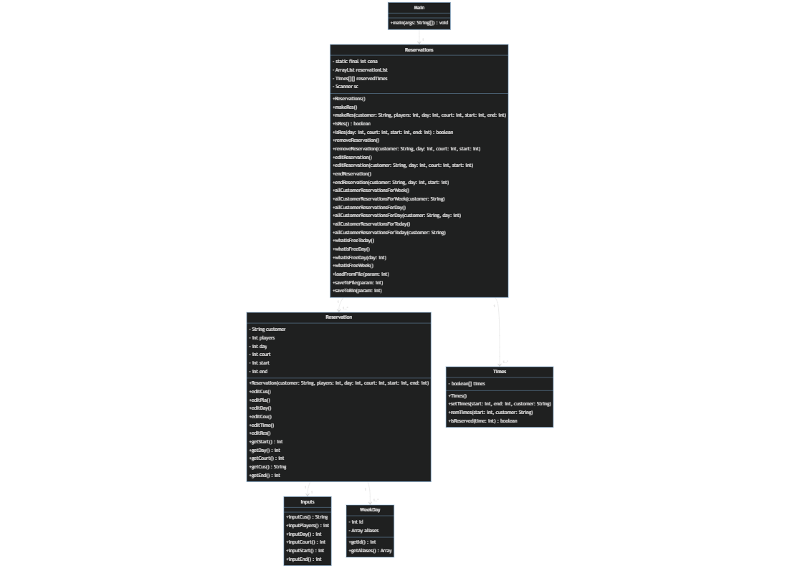

## **Zadání Semestrální práce**

### **Motivace**
Můj otec chtěl už dlouho implementovat rezervační systém pro Tenisový klub u nás ve městě, aby chod v tamní klubu šel hladce a bylo vše aspoň nějak evidováno. Tak mě napadlo, proč s tímto nezačít jako se semestrální prací.

### **Vytvoření rezervačního systému pro Tenisové kurty.**
Tato aplikace bude ovládána přes příkazy v příkazové řádce Javy. Program bude fungovat tak, že poté, co se zapne, tak bude čekat na příkazy od uživatele. Budou zde příkazy jako např. list(vypíše časy v daném dni, ke kterým jsou přiřazené rezervace + info k dané rezervaci, v případě že zde není žádný napsaný, vyhodí hlášku); res + vstupní prvky (zarezervuje v zadaném čase zadaný kurt pro zadaný počet lidí); rem(odstranění rezervace); edit(úprava rezervace); atd. . Nadále ve výpisech bude automaticky spočítaná cena za rezervaci i za odehrané hodiny na kurtě.

Veškeré příkazy budou u finální verze programy napsány v commandu help, či zde v readme.

### **Rozvržení na body.**
-rozdělení podle času (časové úseky po 1 hodině)  
-možnost rezervování daného kurtu na přesný čas  
-možnost zadat kolik hráčů bude hrát na daném kurtu pro rozpočítání ceny  
-rezervace budou uloženy do dynamického pole, pro lepší práci s daty 
-program bude ukládat rezervace do souboru po týdnu(bude možnost zapisovat na aktuální týden a následující) 
-bude zde command "newWeek" který vezme soubor s aktuálním týdnem a jeho obsah připíše na konec souboru s historií rezervací, soubor s následujícím týdnem se přepíše do souboru s aktuálním týdnem a soubor s následujícím týdnem bude volný pro nová data 

### **Popis Struktury vstupních a výstupních souborů**
-Je zde možnost ukládání a čtení dat z binárních souborů, či do datového typu .json
-data jsou pojmenovány: "save_(číslo týdne v roce).bin/json" a jsou rozděleny do složek podle datového typu souboru
-Data jsou při ukončení programu zapsány do datové struktury **.json** s pomocí externí knihovny **GSON** pro Java Maven - toto bude primární datový výstup 

### **Class Diagram**

